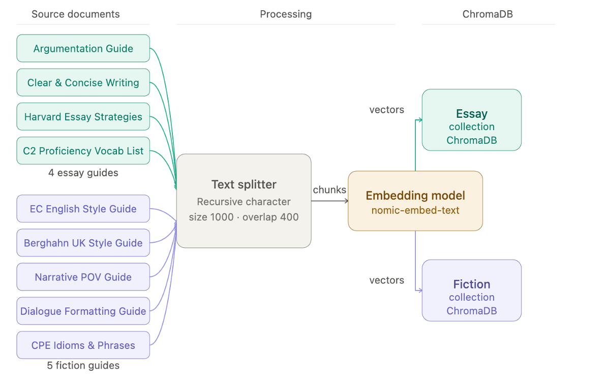
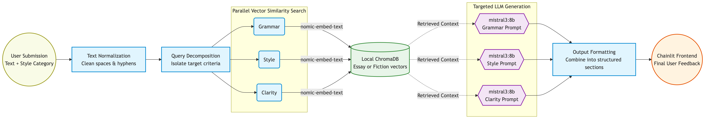

# Local Quill

A **privacy-first writing assistant** powered by local language models and retrieval-augmented generation (RAG).

## Overview

Local Quill provides targeted writing feedback across two categories: **essays** and **fiction**. Unlike cloud-based services, all processing happens locally on your machine using quantized 8B parameter LLMs, ensuring complete data privacy and on-device control.

**Key Research Finding**: With proper RAG context and prompt engineering, local models (ministral-3:8b) outperform GPT-5-nano on grammar, style, and clarity feedback metrics, making powerful writing assistance accessible without cloud dependencies.

## Architecture

Local Quill uses **Query Decomposition** and **Retrieval-Augmented Generation** to deliver focused, high-quality feedback from smaller models.

**Data Ingestion**:



**Workflow**:




### Core Components

- **Vector Database**: ChromaDB stores embeddings of writing guides and style manuals
- **Retrieval**: Query decomposition retrieves criterion-specific context (grammar, style, clarity)
- **LLM**: Local models (Ollama) generate targeted feedback per dimension
- **Frontend**: Chainlit provides interactive interface
- **Evaluation**: G-Eval (LLM-as-judge) framework assesses feedback quality


## Prerequisites

- **Python 3.12+**
- **Ollama** (for local LLMs): [Download here](https://ollama.com)
- **UV** (Python package manager): [Installation guide](https://github.com/astral-sh/uv)
- **RAM**: 8GB minimum

## Quick Start

### 1. Install UV

**Mac/Linux**:
```sh
curl -LsSf https://astral.sh/uv/install.sh | sh
```

**Windows** (PowerShell):
```powershell
powershell -ExecutionPolicy ByPass -c "irm https://astral.sh/uv/install.ps1 | iex"
```

### 2. Clone & Setup

```sh
git clone https://github.com/sky150/loaclQuill
cd loaclQuill

# Sync dependencies
uv sync

# To create a new virtual environment with Python 3.12:
uv venv --python 3.12

# Activate virtual environment
.venv\Scripts\Activate.ps1

# Initiate project
uv init
```

### 3. Download Ollama Models

Our recommendations:
```sh
ollama pull nomic-embed-text
ollama pull ministral-3:8b
```

### 4. Generate RAG Database

Initialize the vector database with writing guides:

**Mac / Linux**
```sh
COLLECTION_NAME=essay DATA_PATH=./data/styles/essay uv run -m src.vector_db.generate_chroma
COLLECTION_NAME=fiction DATA_PATH=./data/styles/fiction uv run -m src.vector_db.generate_chroma
```

**Windows**
```sh
$env:COLLECTION_NAME="essay"; $env:DATA_PATH="./data/styles/essay"; uv run -m src.vector_db.generate_chroma
$env:COLLECTION_NAME="fiction"; $env:DATA_PATH="./data/styles/fiction"; uv run -m src.vector_db.generate_chroma
```

### 5. Launch the Interface

**Mac / Linux**
```sh
PYTHONPATH=. uv run chainlit run src/frontend/app.py
```

**Windows**
```sh
$env:PYTHONPATH="."; uv run chainlit run src/frontend/app.py
```

Open your browser to `http://localhost:8000` and start writing!

## Common Commands

### Initialize Vector Database

```sh
# Generate essay database (default)
uv run -m src.vector_db.generate_chroma

# Generate fiction database
COLLECTION_NAME=fiction DATA_PATH=./data/styles/fiction uv run -m src.vector_db.generate_chroma

# Reset all databases (deletes and regenerates)
uv run -m src.vector_db.generate_chroma --reset
```

**Note**: This loads PDFs from `./data/styles/` into ChromaDB using the embedding model specified in `.env`.

### Run Tests

```sh
# Test the RAG pipeline
PYTHONPATH=. uv run python tests/unit/test_rag.py

# Run content filter tests
PYTHONPATH=. uv run python tests/unit/test_content_filter.py
```

## Configuration

All configuration is managed through the `.env` file. **Copy [.env.example](.env.example) to `.env` and customize** for your setup.

### Common Configuration Options

| Variable | Default | Description |
|----------|---------|-------------|
| `COLLECTION_NAME` | `essay` | `essay` or `fiction` |
| `CHUNK_SIZE` | `1000` | Characters per document chunk for embeddings (1000 recommended) |
| `CHUNK_OVERLAP` | `400` | Character overlap between chunks (400 recommended for high recall) |
| `EMBEDDING_PROVIDER` | `ollama` | `ollama` or `huggingface` |
| `EMBEDDING_MODEL` | `nomic-embed-text` | Model for generating embeddings |
| `LOCAL_MODEL` | `ministral-3:8b` | Default LLM for feedback generation |
| `JUDGE_MODEL` | `llama3.1` | LLM for evaluation scoring (used by G-Eval) |
| `TEMPERATURE` | `0.1` | 0.0 (deterministic) to 1.0 (bit more creative) |
| `TOP_K` | `3` | Number of document chunks to retrieve |
| `USER_TEXT_SPLIT` | `10'000` | Character limit per LLM call (roughly 2'000 words) |
| `USE_BASE_MODEL` | `false` | Use per-criterion models from `base_models.json` |
| `USE_GUARDRAILS` | `true` | Enable prompt injection detection |
| `OPENAI_API_KEY` | (not requiered) | Your OpenAI key (used for comparison) |
| `CHROMA_PATH` | `./chroma` | Path to vector database |

## Evaluation & Benchmarking

Local Quill uses **G-Eval**, an LLM-as-judge framework, to measure feedback quality. Three metrics are evaluated:

- **Grammar**: Accuracy and coverage of grammar error detection
- **Style**: Effectiveness of style improvement suggestions  
- **Clarity**: Success in improving text comprehension

### Run Evaluation Suite

```sh
# Generate separate evaluation database
COLLECTION_NAME=essay DATA_PATH=./data/styles/essay CHROMA_PATH=./tests/chroma_eval \
  uv run -m src.vector_db.generate_chroma

# Run retrieval evaluation (test embedding models)
PYTHONPATH=. uv run python tests/eval/run_retrieval_eval.py

# Run generation evaluation (test LLM models)
PYTHONPATH=. uv run python tests/eval/run_generation_eval.py

# Run batch LLM test
PYTHONPATH=. uv run python tests/eval/batch_llm_test.py
```

**Note**: Full evaluation takes 1-3 hours on a 32GB system. Results are saved to `./reports/`.

### Jupyter Notebooks

Visualize and analyze evaluation results:

```sh
uv run jupyter notebook tests/notebooks/
```

Available notebooks:
- `visualize_report_embedding.ipynb` - Embedding model performance
- `visualize_report_llm.ipynb` - LLM generation quality
- `simple_rag.ipynb` - RAG pipeline walkthrough
- `Testing.ipynb` - Quick testing and debugging

## Troubleshooting

### "ChromaDB collection not found"
- Ensure you've run `uv run -m src.vector_db.generate_chroma` for your collection

### "Ollama models not found"
- Don't forget to run the models: `ollama list`
- Download required models: `ollama pull nomic-embed-text && ollama pull ministral-3:8b`

### Slow feedback generation
- Reduce `TOP_K` in `.env` (fewer retrieved chunks = faster)
- Use `TEMPERATURE=0.0` for deterministic, faster responses
- Ensure `USER_TEXT_SPLIT` isn't too small (causes more LLM calls)

### "Content filter blocking legitimate input"
- Check `.env` for `USE_GUARDRAILS=false` to disable temporarily
- Review regex patterns in `src/guardrails/content_filter.py`

### GPU/Memory issues
- Reduce `CHUNK_SIZE` in `.env` 
- Use a smaller embedding model (e.g., `all-MiniLM-L6-v2` )

## License

This project uses public writing guides and test materials from academic institutions. Please refer to individual PDFs in `./data/styles/` for proper attribution.

## Authors
- **Natalie Sumbo Filipe**
- **Silas Schuler**